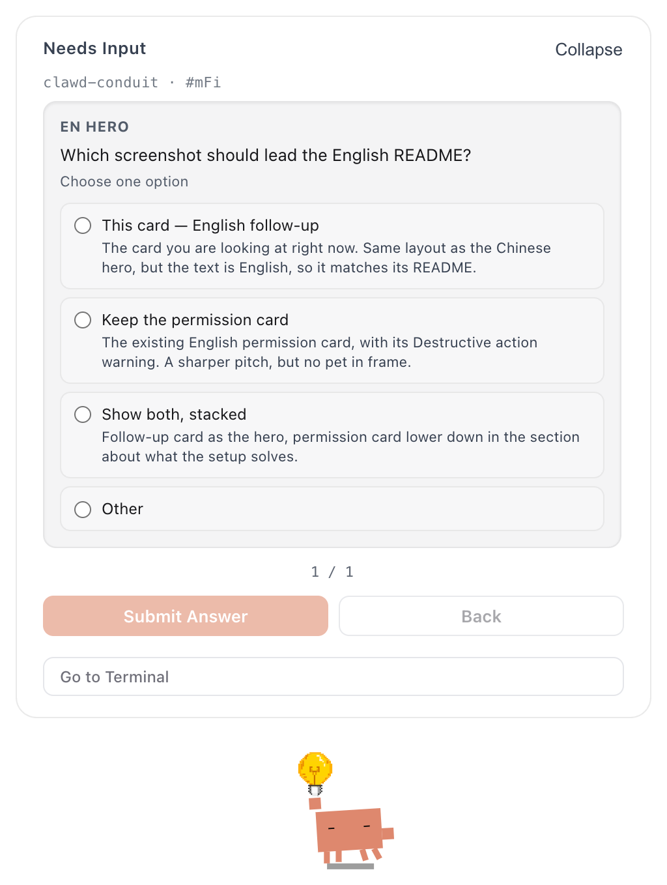
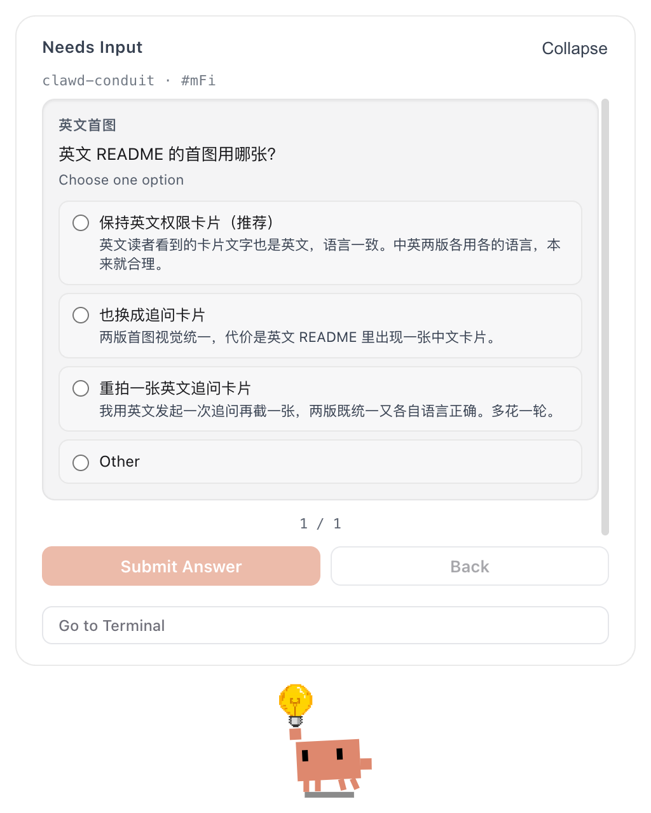
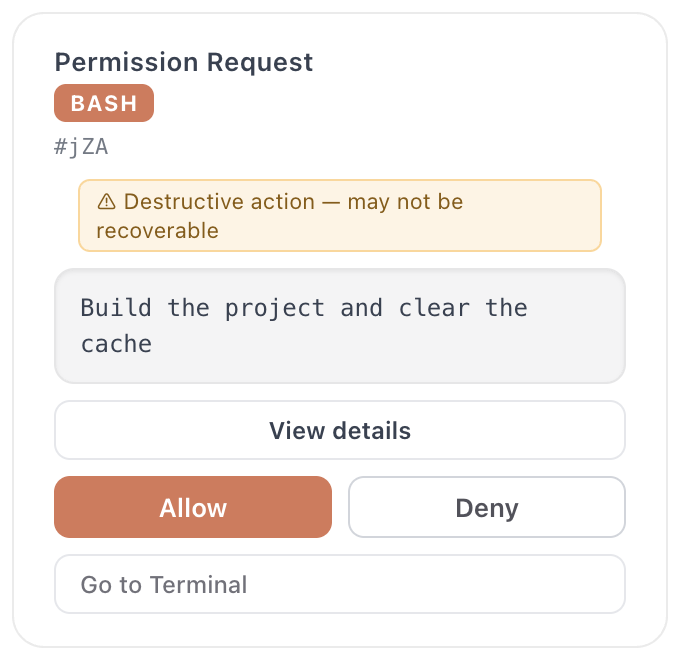

# clawd-conduit

> Wire a desktop pet into what your Claude Code session is *actually* doing — all 15 hook events.

[中文](./README.md) · macOS · MIT

<p align="center">
  
  
</p>
<p align="center">
  <sub>When Claude Code asks you to pick between options, the card lands on the desktop — and the
  pet switches to its lightbulb "needs input" pose.<br>
  The card follows Clawd's own language setting; English and Chinese both shown</sub>
</p>

## What this is

[Clawd on Desk](https://github.com/rullerzhou-afk/clawd-on-desk) is a desktop pet
that watches AI coding agents. It ships with Claude Code integration and works
out of the box.

This repo is **a complete wiring layer on top of it**: all 15 Claude Code
lifecycle hook events, plus a notification script, an idempotent
install/uninstall toolchain, and the parameter trade-offs I settled on after
three months of daily use.

The difference is granularity. With fewer events the pet roughly knows whether
you're *busy or idle*. With all 15 it can tell you're **running a tool**, that a
**tool just failed**, that **subagents are running in parallel**, that **context
is being compacted** — or that it's **blocked on a confirmation waiting for you**.

**That last one is the whole point.**

## The problem it actually solves

During long runs you leave the terminal — docs, messages, coffee. You come back
and find it stopped three minutes ago waiting for you to click "allow."

This config cuts those three minutes to zero:

- Permission requests surface as a desktop card: `Cmd+Shift+Y` to allow,
  `Cmd+Shift+N` to deny — **no window switching**
- The card **never auto-dismisses** (`permissionBubbleAutoCloseSeconds: 0`).
  Auto-dismiss is the worst default here: you think you denied it, but it just
  timed out and fell back to the terminal prompt
- Dock flash + sound on completion, so you catch it from another app
- Tool failures change the pet's state immediately — no scrolling back to find
  which step blew up

<p align="center">
  
</p>
<p align="center">
  <sub>When the command contains <code>rm -rf</code>, the card raises a <b>Destructive action</b> warning on its own</sub>
</p>

## How it works

Claude Code fires hooks at key points in a session's lifecycle. This config
forwards **14 of them** as `command` hooks to Clawd's bundled `clawd-hook.js`,
and routes **one more** — the permission request — as an `http` hook straight to
Clawd's local port.

```
Claude Code                          Clawd on Desk
    │
    ├─ SessionStart ─┐
    ├─ PreToolUse  ──┤  command hook
    ├─ Stop        ──┼─→ clawd-hook.js ──→ POST 127.0.0.1:23333/state ──→ pet changes state
    ├─ … (14 total) ─┘        (async, 5s timeout, never blocks the session)
    │
    └─ PermissionRequest ─→ HTTP hook ──→ POST 127.0.0.1:23333/permission
                                              (blocking, 600s timeout)
                                                    │
                                          card pops ┴─→ you click Allow / Deny
                                                         └─→ decision returns, session continues
```

The two channels differ in **whether they wait for you**. State events are
one-way broadcasts — fire and forget. A permission request has to stop and wait
for a human decision, which is why it is the only blocking one.

### Events and pet states

Taken from Clawd's `clawd-hook.js` (`EVENT_TO_STATE`) — not guesswork:

| Event | Pet state | When it fires |
|---|---|---|
| `SessionStart` | `idle` | Session begins. This config also attaches `open -ga` to launch the app |
| `UserPromptSubmit` | `thinking` | You hit enter |
| `PreToolUse` | `working` | Before every tool call |
| `PostToolUse` | `working` | Tool returned successfully |
| `PostToolUseFailure` | `error` | Tool errored |
| `SubagentStart` | `juggling` | A subagent starts — literally starts juggling |
| `SubagentStop` | `working` | Subagent finished |
| `PreCompact` | `sweeping` | Before context compaction, the pet starts sweeping |
| `PostCompact` | `thinking` | Compaction done. Deliberately **not** `attention` — compacting isn't completion |
| `Stop` | `attention` | Turn finished normally; it comes to get you |
| `StopFailure` | `error` | Turn ended abnormally |
| `Notification` | `notification` | Claude needs your attention |
| `Elicitation` | `notification` | Claude asks *you* a question (the card in the hero shot) |
| `SessionEnd` | `sleeping` | Session over, pet goes to sleep |
| `PermissionRequest` | — | Goes through the HTTP channel and pops a card directly |

One detail worth knowing: on some builds Claude Code reports subagent launches
only as `PreToolUse(Task)` without a native `SubagentStart`. Clawd handles this
by switching to `juggling` on the `Task` / `Agent` tool name — so parallel work
never goes unreported.

### Why the template uses absolute paths

```json
"command": "\"/opt/homebrew/bin/node\" \"/Applications/Clawd on Desk.app/…/clawd-hook.js\" Stop"
```

Hooks run in a **non-login shell**, where `PATH` may not include Homebrew. A bare
`node` becomes command-not-found — and because these are `async: true`, you never
see the error. The symptom is just a pet that quietly stops moving. `install.sh`
detects and fills both paths for you.

The path contains a space (`Clawd on Desk.app`), so every segment must be quoted.

## Quick start

```bash
# 1. Install Clawd on Desk itself (not bundled or redistributed here)
#    https://github.com/rullerzhou-afk/clawd-on-desk/releases

# 2. Apply this config
git clone https://github.com/ssssssanjiu/clawd-conduit.git
cd clawd-conduit
bash install.sh
```

Start a new Claude Code session to pick it up.

### What install.sh does

1. **Locate Clawd** — checks `/Applications`, then `~/Applications`, then falls
   back to `mdfind` on bundle id `com.clawd.on-desk`. Fails loudly with a
   download link if it can't find it.
2. **Locate node** — checks `/opt/homebrew/bin/node`, `/usr/local/bin/node`,
   then `command -v node`.
3. **Back up** — copies your `settings.json` to `settings.json.bak.<timestamp>`.
4. **Merge hook config** — fills the placeholder template with real paths.
   **Preserves your other hooks per event**, replacing only entries this repo
   wrote itself.
5. **Install the notification script** — copies it to `~/.claude/hooks/` and
   attaches it to `Notification` (skippable).
6. **Validate** — runs `python3 -c "json.load(...)"` to confirm the JSON it wrote
   is still parseable.

**Safe to re-run.** A second run replaces rather than appends; the occurrence
count of `clawd-hook.js` stays at exactly 14.

### Verify it took

```bash
# 1. Are all 15 events wired?
python3 -c "import json;h=json.load(open('$HOME/.claude/settings.json'))['hooks'];\
print(len([k for k,v in h.items() if 'clawd' in json.dumps(v).lower() or '23333' in json.dumps(v)]),'events')"

# 2. Is Clawd's local service listening?
lsof -nP -iTCP:23333 -sTCP:LISTEN

# 3. Does the hook script path actually exist?
ls -l "/Applications/Clawd on Desk.app/Contents/Resources/app.asar.unpacked/hooks/clawd-hook.js"
```

The first should print `15 events`; the second should show a `Clawd on Desk`
process. Once both check out, start a session and send any message — the pet
should go from `idle` to `thinking`.

## Troubleshooting

<details>
<summary><b>The pet does nothing at all</b></summary>

Check three things, in order:

1. **Wrong node path.** By far the most common cause. Hooks are `async`, so
   failures are completely silent. Run one by hand to see the error:
   ```bash
   echo '{"session_id":"t","hook_event_name":"Stop"}' | \
     /opt/homebrew/bin/node "/Applications/Clawd on Desk.app/Contents/Resources/app.asar.unpacked/hooks/clawd-hook.js" Stop
   ```
2. **Clawd isn't running.** `pgrep -f "Clawd on Desk"` should print a PID.
3. **Config wasn't reloaded.** Hooks are read at session start — you need a
   **new session**; the current one won't hot-reload.
</details>

<details>
<summary><b>Permission cards don't appear</b></summary>

- `permissionBubblesEnabled` must be `true` in Clawd's settings
- `hideBubbles` must be `false`
- Port 23333 must be listening (check #2 above)
- If you run Claude Code with `--dangerously-skip-permissions`, or the action is
  already allowlisted, no permission request is generated at all — that's not a bug
</details>

<details>
<summary><b>Notification bubbles don't appear, but permission cards do</b></summary>

You probably set `notificationBubbleAutoCloseSeconds` to `0`.

**The two bubble kinds treat `0` in opposite ways.** For permission bubbles `0`
means "never auto-close." For notification bubbles it evaluates to
`enabled: false` — it **turns the feature off**. To make notification bubbles
linger, set it high (3600 is the cap), not to zero.

Details in [docs/recommended-prefs.md](./docs/recommended-prefs.md).
</details>

<details>
<summary><b>My existing hooks disappeared after installing</b></summary>

This shouldn't happen — the merge preserves non-repo entries per event, and the
uninstall round-trip is tested to restore the file exactly. If it does, recover
from the backup the installer wrote:

```bash
ls -t ~/.claude/settings.json.bak.* | head -1   # most recent
```

Please also open an issue with the shape of your original config.
</details>

<details>
<summary><b>I also run Codex or another agent</b></summary>

No conflict. Clawd tracks sessions per agent, and this repo only writes the
Claude Code side (`~/.claude/settings.json`) — it never touches `~/.codex/` or
other agents' config.

Claude Code **subagents request permissions too** — turn on
`subagentPermissionsEnabled` in Clawd's settings, or subagent requests won't
raise a card and you'll appear to hang for no reason.
</details>

## Compatibility

| | Requirement |
|---|---|
| OS | macOS (the notification script uses `osascript`; the hook config itself is portable but untested on Windows/Linux) |
| Clawd on Desk | Verified from v0.10.0; v1.0.0 is the current test version |
| Claude Code | Needs `http`-type hook support for `PermissionRequest` |
| node | Any version — only used to run Clawd's own bundled hook script |
| python3 | System python is fine (used by the installer and notification script) |

> Keep `manageClaudeHooksAutomatically` enabled in Clawd's settings — it repairs
> the app paths inside your hooks after a Clawd upgrade, so you don't have to
> re-run `install.sh` every time.

## What's inside

```
├── install.sh                        # path detection + idempotent merge
├── uninstall.sh                      # clean removal, keeps your other hooks
├── settings/
│   └── clawd-hooks.template.json     # all 15 events, paths as placeholders
├── hooks/
│   └── notify-input-needed.py        # macOS banner + Glass sound
└── docs/
    ├── hook-events.md                # every event explained, and why absolute paths
    └── recommended-prefs.md          # the Clawd settings I actually run, with reasons
```

## About the notification script

`hooks/notify-input-needed.py`, about 20 lines:

On a Claude Code `Notification` event it reads the event JSON from stdin, pulls
out the message, and fires a system banner with the Glass sound via `osascript`.

It **complements** Clawd's own bubble rather than replacing it: Clawd's bubble is
on-screen and interactive; the system banner lands in Notification Center and
reaches you inside fullscreen apps. Run both and you miss the least.

The reason it's needed: Clawd's "passive notification" bubbles serve only agents
without a decision channel, like Codex and Kimi (see `passive-notify-entry.js`).
Claude Code goes through the decision-carrying path, so the only cards you ever
see are permission cards and follow-up cards — pure state changes produce no
bubble at all. This script fills that gap.

Skip it with `INSTALL_NOTIFY=0 bash install.sh`.

## Uninstall

```bash
bash uninstall.sh
```

Removes the hook config only; leaves the Clawd app untouched. Backs up first.
Round-trip tested: after uninstalling, `settings.json` is **byte-for-byte
identical** to what it was before installing.

## Environment variables

| Variable | Default | Purpose |
|---|---|---|
| `CLAWD_APP` | auto-detected | Path to Clawd.app |
| `NODE_BIN` | auto-detected | Path to the node binary |
| `CLAUDE_SETTINGS` | `~/.claude/settings.json` | Point at a different settings file |
| `CLAUDE_HOOK_DIR` | `~/.claude/hooks` | Point at a different hooks dir |
| `INSTALL_NOTIFY` | `1` | Set `0` to skip the notification script |

## Upstream

The pet itself is **[Clawd on Desk](https://github.com/rullerzhou-afk/clawd-on-desk)**
([@rullerzhou-afk](https://github.com/rullerzhou-afk), AGPL-3.0-only). You need it
installed before this config does anything. If you like it, go star the upstream repo.

This repository bundles and redistributes none of Clawd's code or binaries — only
config templates, install scripts, and docs.

## License

MIT. See [LICENSE](./LICENSE) and [NOTICE.md](./NOTICE.md).
