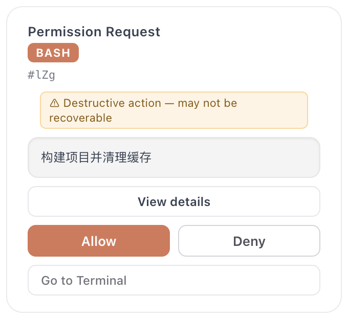

# claude-code-pet-setup

> 让桌面宠物真正「懂」你的 Claude Code 会话——15 个 hook 事件的完整接线方案。

[English](./README.en.md) · macOS · MIT

<p align="center">
  
</p>
<p align="center">
  <sub>Claude Code 想执行 <code>rm -rf</code> 时弹出的卡片。<code>Cmd+Shift+Y</code> 允许，<code>Cmd+Shift+N</code> 拒绝——<b>不用切回终端</b></sub>
</p>

## 这是什么

[Clawd on Desk](https://github.com/rullerzhou-afk/clawd-on-desk) 是一只会盯着
AI 编程 agent 的桌面宠物。装完它默认就能用，但**默认配置只接了一部分事件**。

这个仓库是我用了三个月之后沉淀下来的那份「全量接线」：把 Claude Code
生命周期里的 **15 个 hook 事件**一次性全部接通，加上一个我自己写的系统通知脚本。

差别是什么：默认状态下宠物大致知道你「在忙 / 不忙」；接完这 15 个事件之后，
它知道你是在**调工具**、**工具失败了**、**子 agent 在跑**、**上下文正在压缩**，
还是**卡在一个权限确认上等你点头**。

**最值钱的是最后一个。**

## 它真正解决的问题

Claude Code 干长任务时，你会离开终端——去看文档、回消息、倒杯水。
然后回来发现它在三分钟前就停下了，等你点一个「允许」。

这套配置把那三分钟压成零：

- 权限请求直接弹成桌面卡片，`Cmd+Shift+Y` 允许、`Cmd+Shift+N` 拒绝，**不用切窗口**
- 卡片**永不自动消失**（`permissionBubbleAutoCloseSeconds: 0`）——超时自动关闭是最坑的默认值，
  你以为拒绝了，其实只是回落到了终端提示
- 任务完成闪 Dock + 提示音，人在别的窗口也接得住
- 工具失败当场变脸，不用回头翻 scrollback 找哪一步炸了

## 快速开始

```bash
# 1. 先装 Clawd on Desk 本体（本仓库不含它，也不重新分发它）
#    https://github.com/rullerzhou-afk/clawd-on-desk/releases

# 2. 套上这份配置
git clone https://github.com/ssssssanjiu/claude-code-pet-setup.git
cd claude-code-pet-setup
bash install.sh
```

脚本会自动探测 Clawd 和 node 的路径、备份你现有的 `settings.json`、
写入 hook 配置。**可以重复运行**，只覆盖自己写的条目，不会叠加，
也不会动你已有的其他 hook。

新开一个 Claude Code 会话即可生效。

## 里面有什么

```
├── install.sh                        # 自动探测路径 + 幂等合并配置
├── uninstall.sh                      # 干净摘除，保留你其他的 hook
├── settings/
│   └── clawd-hooks.template.json     # 15 个事件的配置模板（路径用占位符）
├── hooks/
│   └── notify-input-needed.py        # 我写的：macOS 横幅 + Glass 提示音
└── docs/
    ├── hook-events.md                # 15 个事件逐条解释，含为什么用绝对路径
    └── recommended-prefs.md          # 我实际在用的 Clawd 设置及理由
```

## 关于那个通知脚本

`hooks/notify-input-needed.py` 是本仓库唯一的原创代码，20 行：

Claude Code 触发 `Notification` 事件时，它从 stdin 读事件 JSON，
取出 message，用 `osascript` 弹一条系统横幅并播放 Glass 提示音。

它和 Clawd 的气泡是**互补**关系，不是替代：Clawd 的气泡在屏幕上、能交互；
系统横幅会进通知中心，你在全屏应用里也能收到。两个都开，漏掉的概率最低。

`INSTALL_NOTIFY=0 bash install.sh` 可以跳过它。

## 卸载

```bash
bash uninstall.sh
```

只摘 hook 配置，不动 Clawd 这个 app 本身。执行前也会自动备份。

## 环境变量

| 变量 | 默认 | 用途 |
|---|---|---|
| `CLAWD_APP` | 自动探测 | Clawd.app 路径 |
| `NODE_BIN` | 自动探测 | node 可执行文件路径 |
| `CLAUDE_SETTINGS` | `~/.claude/settings.json` | 换个 settings 文件（便于试） |
| `CLAUDE_HOOK_DIR` | `~/.claude/hooks` | 换个 hook 目录 |
| `INSTALL_NOTIFY` | `1` | 设 `0` 跳过通知脚本 |

## 致谢与许可

宠物本体 **[Clawd on Desk](https://github.com/rullerzhou-afk/clawd-on-desk)**
由 [@rullerzhou-afk](https://github.com/rullerzhou-afk) 开发，**AGPL-3.0-only**。
所有动画、交互和那个本地权限服务都是他的功劳——本仓库只是把它接进 Claude Code 的一份配置。

本仓库**不包含也不重新分发** Clawd 的任何代码或二进制，仅有配置模板、安装脚本和文档，
以 **MIT** 授权。详见 [NOTICE.md](./NOTICE.md)。

如果这套配置对你有用，请去给 [上游仓库](https://github.com/rullerzhou-afk/clawd-on-desk) 点个 star。
